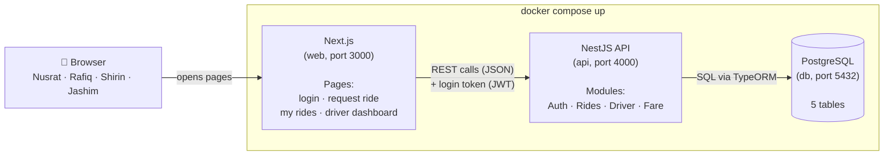
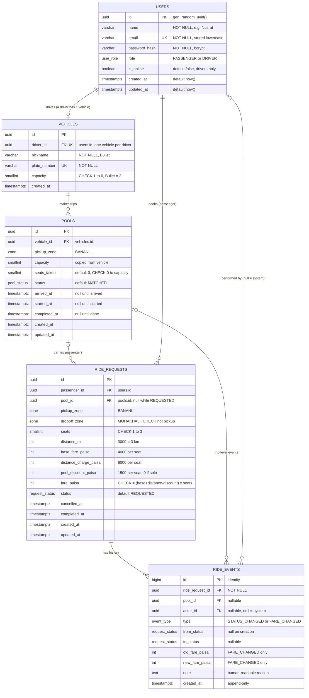
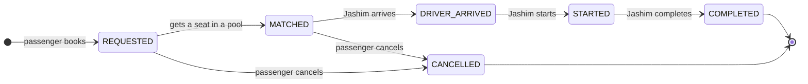
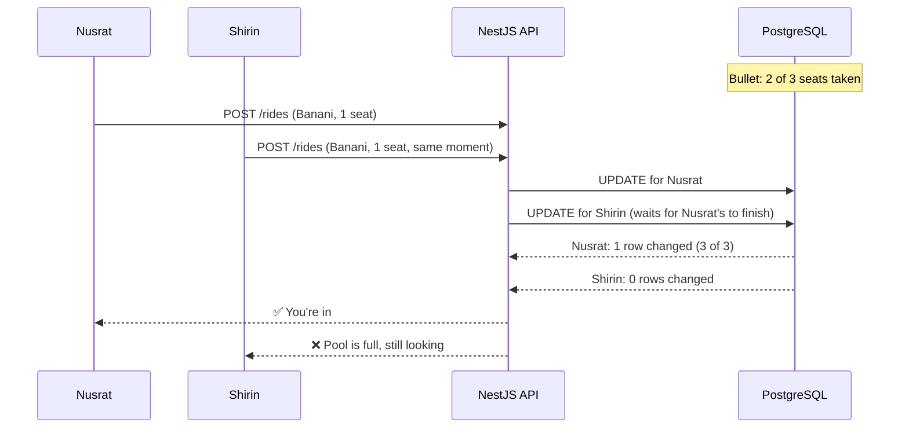
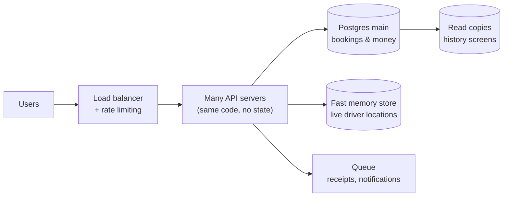

# Dhaka Tesla Pool — Architecture

> Share a seat. Split the fare. Survive Dhaka traffic.

**Stack:** Next.js (frontend) · NestJS (backend, REST API) · PostgreSQL (database) · TypeORM (ORM) · Docker Compose

**Cast:** Jashim drives **Bullet** (3 seats). Nusrat, Rafiq and Shirin are passengers.

This file has five diagrams. Together they answer: *how the parts connect, what data we store, how a ride moves, and how we stop two people grabbing the same seat.*

---

## 1. System architecture

Three boxes, one direction. The browser only talks to Next.js, Next.js only talks to the API, and only the API talks to the database.



**What each part does**

| Part | Job | Example |
|---|---|---|
| **Browser** | What people see and click | Nusrat taps "Request ride" |
| **Next.js** | Shows pages, calls the API | Shows Nusrat's fare and status |
| **NestJS API** | Checks who you are, applies all rules | "Is there a free seat? Is this your ride?" |
| **PostgreSQL** | Stores everything safely | Bullet's seats, every ride, every status or fare change |

**Inside the API: four modules**

- **Auth** — sign up, log in, gives a JWT token. Passwords are hashed with bcrypt.
- **Rides** — passenger requests a ride, sees their own rides, cancels.
- **Driver** — Jashim goes online/offline, accepts a request, marks arrived → started → completed.
- **Fare** — calculates each passenger's fare. Pure math, no database, easy to test.

Every request passes the same checks first: **Is the input valid?** (validation) → **Who is this?** (JWT) → **Are they allowed?** (passenger vs driver, and "is this your own ride?").

**Why REST?** Our actions map cleanly to resources (`/rides`, `/pools`) and simple verbs. GraphQL would add setup without solving a problem we have.

**Why TypeORM?** It is NestJS's most common ORM (`@nestjs/typeorm`), so modules, entities and dependency injection fit together with little glue. Tables are plain TypeScript classes (entities), and it has what this app needs most: **transactions**, **raw SQL when we want it**, and **migrations**.

| | TypeORM (picked) | Prisma | Raw SQL (`pg`) |
|---|---|---|---|
| Fits NestJS | ✅ official module, decorators | Works, needs a small wrapper service | Manual |
| Transactions + atomic `UPDATE … WHERE` | ✅ `dataSource.transaction()` + QueryBuilder | ✅ | ✅ |
| Migrations | ✅ generate + run | ✅ | Write by hand |
| Watch-outs | `synchronize: true` must stay **off**; relations can hide extra queries | Separate schema language | Lots of boilerplate |

**Rules we follow with TypeORM:**
- `synchronize: false` always. The schema changes **only through migrations** (`migration:generate` → review → `migration:run`), so the database the evaluator gets is exactly what's in git.
- CHECK constraints are declared on entities with `@Check(...)` so they end up in the migration.
- Seat claiming uses a QueryBuilder `UPDATE` (see §5), never "load entity → change number → `save()`", because that read-then-write is exactly the race we're trying to avoid.

**When we'd switch:** if the query layer gets complex enough that type-safety of query results matters more than NestJS integration, Prisma or Drizzle would be worth it.

---

## 2. Database (ERD)

Five tables. That's all the MVP needs. **Full column types, constraints, indexes and example rows are in [ERD.md](./ERD.md).**



**One line per table**

| Table | Why it exists |
|---|---|
| `users` | Everyone who logs in. `role` tells passenger from driver. |
| `vehicles` | Bullet and its capacity (3). One vehicle per driver. |
| `pools` | One trip of one vehicle. Tracks how many seats are taken. |
| `ride_requests` | One passenger's booking: from, to, seats, **their own** fare (with breakdown) and status. `pool_id` shows which pool they're in. |
| `ride_events` | Every status or fare change with who and when. This is how we "explain what happened" later. |

**Rules the database itself enforces**

- `CHECK (seats_taken BETWEEN 0 AND capacity)` on `pools` — even buggy code can't put 4 people in Bullet.
- `CHECK (seats BETWEEN 1 AND 3)` and `CHECK (pickup_zone <> dropoff_zone)` on `ride_requests`.
- `CHECK (fare_paisa = (base + distance − discount) × seats)` — a fare that doesn't add up can't be saved.
- `CHECK (status IN ('REQUESTED','CANCELLED') OR pool_id IS NOT NULL)` — a matched passenger is always in a pool.
- Partial unique indexes: **one active ride per passenger**, **one active trip per vehicle**.
- `email` is unique; all foreign keys are `ON DELETE RESTRICT` so history is never lost.

**Money is stored in paisa as an integer.** 85 taka = `8500`. Floats can't store money exactly (`0.1 + 0.2 ≠ 0.3`), integers can. We divide by 100 only when showing it.

**Zones are a fixed list** stored as a Postgres enum (Banani, Gulshan 1, Mohakhali, Dhanmondi, Mirpur, Uttara, Farmgate, Bashundhara) with a small distance table in code. No maps API.

**Payment:** cash only. Recorded, not processed.

---

## 3. Ride lifecycle

A ride request moves one step at a time. Anything else is rejected.



- The **pool** uses the same steps. When Jashim taps "Arrived", "Start" or "Complete", the pool **and every passenger in it** move together.
- Cancel is allowed only **before the driver arrives**. Cancelling frees the seat.
- A wrong jump (e.g. `REQUESTED → COMPLETED`) returns an error `409`.
- Every step writes one row into `ride_events`.

**Assumption:** all passengers in a pool are dropped off before the pool is marked completed; Jashim completes the trip once at the end. (Per-passenger drop-off is a listed next improvement.)

---

## 4. Matching rule and fare

**Matching rule (simple, documented):**
> Two requests can share a pool if they have the **same pickup zone**, the **driver hasn't arrived yet** (pool is still `MATCHED`), and there are **enough free seats**.

Nusrat (Banani → Mohakhali) and Rafiq (Banani → Gulshan 1) both start at Banani, so they share Bullet.

**Fare formula:**

```
fare = (base fare + (distance km × per-km rate) − pool discount) × seats
base fare = 40 taka · per km = 20 taka · pool discount = 25% of distance charge (only if pool has 2+ passengers)
```

| | Nusrat (Banani → Mohakhali, 3 km) | Rafiq (Banani → Gulshan 1, 4 km) |
|---|---|---|
| Base | 40 | 40 |
| Distance | 3 × 20 = 60 | 4 × 20 = 80 |
| Pool discount | −15 | −20 |
| **Fare** | **85 taka (8500 paisa)** | **100 taka (10000 paisa)** |

---

## 5. The last-seat problem (Nusrat vs Shirin)

Bullet has **1 seat left**. Nusrat and Shirin both request a ride from Banani at the same moment, and both are auto-matched to Bullet's pool.

**The trap:** if the code first *reads* "1 seat free" and then *writes* "+1", both requests can read before either writes → 4 people in a 3-seat car.

**The fix:** check and update in **one SQL statement**. The database runs them one after another, never both at once.

```sql
UPDATE pools
SET seats_taken = seats_taken + :seats
WHERE id = :poolId
  AND status = 'MATCHED'                 -- driver hasn't arrived yet
  AND seats_taken + :seats <= capacity;  -- enough seats are still free
-- 1 row changed → you got the seat
-- 0 rows changed → pool is full
```



**The same thing in TypeORM** (inside one transaction, together with the status change and the history row):

```ts
await this.dataSource.transaction(async (manager) => {
  const result = await manager
    .createQueryBuilder()
    .update(Pool)
    .set({ seatsTaken: () => 'seats_taken + :seats' })
    .where('id = :poolId', { poolId })
    .andWhere('status = :status', { status: 'MATCHED' })
    .andWhere('seats_taken + :seats <= capacity')
    .setParameters({ seats })
    .execute();

  if (result.affected === 0) {
    throw new ConflictException({ code: 'POOL_FULL', message: 'This ride just filled up' });
  }

  // same transaction: ride_request → MATCHED, then insert a ride_events row
});
```

If anything inside the transaction fails, **everything** is rolled back: no seat taken, no status change, no history row.

**Safety net:** the `CHECK (seats_taken BETWEEN 0 AND capacity)` constraint (declared with `@Check` on the `Pool` entity) blocks it at the database level too.

**Tested by:** sending both requests at the same time with `Promise.all`, then checking exactly one succeeded and `seats_taken` is 3.

**At larger scale:** this still works, because at most 3 people ever compete for one pool. The bigger challenge would be matching thousands of requests across the city, which we'd split by zone and handle in order.

---

## 6. How it runs

`docker compose up` starts three containers in order:

1. **db** (PostgreSQL) — waits until healthy
2. **api** (NestJS) — runs TypeORM migrations (`migration:run`), seeds Jashim, Bullet, Nusrat, Rafiq and Shirin, then starts
3. **web** (Next.js) — starts once the API is up

Settings come from `.env` (copy `.env.example`). No real secrets are committed.

---

## 7. What we deliberately left out

The brief says: add complexity only when there's a reason.

| Not used | Why not now | When we'd add it |
|---|---|---|
| Redis | Postgres is fast enough for this load | Tracking live locations of thousands of drivers |
| Queues / Kafka | Matching is one quick database update | City-wide matching needs to be processed in order per zone |
| WebSockets | Pages refresh status every few seconds (polling) — simple and enough for a demo | Live maps and instant updates |
| Microservices / Kubernetes | One small app, one database | Many teams, parts that need to scale separately |
| Real maps | Brief says not needed | Real routes and ETAs |

---

## Bonus: if Oi Tesla goes viral (not built)

1M passengers, 100k drivers. The numbers show where the pressure is:

- Ride requests at peak: about **30 per second** — Postgres handles this.
- Driver locations (100k drivers, every 4 s): about **25,000 per second** — this is the real load.



- **Bookings stay in Postgres** — they must be correct.
- **Locations go to a fast memory store** — losing a 4-second-old location is fine.
- **Read copies** of the database serve "my ride history" so the main one stays free for bookings.
- **Idempotency keys** stop a double-tap on bad network from booking twice.
- **Logs, metrics and alerts** show problems like slow matching early.