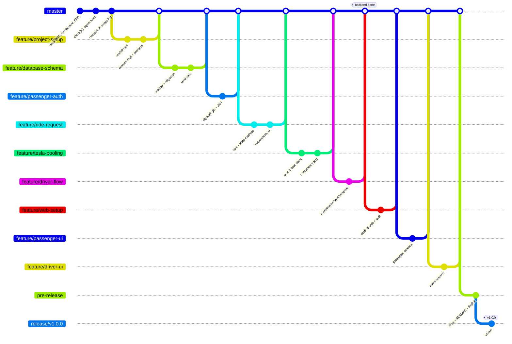

# Dhaka Tesla Pool — Build Playbook (AI prompts, step by step)

> Understand → Design → Build → Commit → Test → Ship → Explain → Debug → Change

This playbook takes the project from an empty folder to `release/v1.0.0`. The work is done with an AI coding agent (Claude Code, Cursor, Copilot…), and it follows the brief's git flow exactly.

**How to use it**

1. Do the steps **in order**. Each step is **one `feature/*` branch**.
   **Backend first (Steps 1–6), then frontend (Steps 7–9).** The whole API is built and tested before any UI code exists, so the UI is built against a finished, stable API.
2. For each step: create the branch → paste the prompt → **review every commit** → run the checks → answer the "understand" questions → merge.
3. Never skip the review. The brief scores **ownership**: you must be able to explain every line in the video and the interview.
4. Work across **real days**. Never fake commit dates; the evaluator reads the timeline.

**Repo:** `dhaka-tesla-pool` · **Stack:** Next.js · NestJS · PostgreSQL · TypeORM · Docker Compose
**Design docs (source of truth):** [`docs/PRD.md`](./PRD.md) · [`docs/ARCHITECTURE.md`](./ARCHITECTURE.md) · [`docs/ERD.md`](./ERD.md) ([ERD.png](./ERD.png))

---

## The whole pipeline at a glance



| # | Branch | Delivers | PRD tests |
|---|---|---|---|
| 0 | `master` | Repo, design docs, AI rules | — |
| | **Phase A: Backend** | | |
| 1 | `feature/project-setup` | Monorepo, NestJS skeleton, Docker Compose (api + postgres), health check | — |
| 2 | `feature/database-schema` | 5 TypeORM entities, migration, seed cast | — |
| 3 | `feature/passenger-auth` | Sign up / in, JWT, roles, validation, errors, logging | — |
| 4 | `feature/ride-request` | Zones, fare, state machine, request / my rides / cancel | T2, T3, T4, T5 |
| 5 | `feature/tesla-pooling` | Matching rule, atomic seat claim, pooled fares | T1, T5, T6 |
| 6 | `feature/driver-flow` | Online/offline, accept, arrive → start → complete, history, demo request file | T2, T4, T5 |
| ✅ | *Backend checkpoint* | Whole demo runs through the API alone | T1–T6 green |
| | **Phase B: Frontend** | | |
| 7 | `feature/web-setup` | Next.js skeleton, web in Docker, API client, login, auth by role | — |
| 8 | `feature/passenger-ui` | Passenger screens | — |
| 9 | `feature/driver-ui` | Driver screens | — |
| | **Phase C: Ship** | | |
| 10 | `pre-release` | Integration fixes, README, scaling doc, deployment | all |
| 11 | `release/v1.0.0` | Tag, deploy, video | — |

---

## Git rules for every step

**Start a step**

```bash
git checkout master
git pull
git checkout -b feature/<name>
```

**While working:** the AI commits; **you** review each commit (`git log -p -1`). If a commit is wrong, ask the AI to fix it with a new `fix(...)` or `refactor(...)` commit. Don't rewrite history that's already pushed.

**Finish a step (via GitHub Pull Request — best traceability)**

```bash
git push -u origin feature/<name>
gh pr create --base master --title "feat(<scope>): <what this branch delivers>" --body "What, why, how tested"
```

On GitHub, merge with **"Create a merge commit"**. ❌ **Never "Squash and merge"**: it collapses your incremental commits into one, which erases the history the evaluator wants to see. **Don't delete** the feature branch.

**Without GitHub PRs (local alternative)**

```bash
git checkout master
git merge --no-ff feature/<name>
git push origin master feature/<name>
```

**Commit format:** `<type>(<scope>): <short description>`

| Types | Scopes used in this project |
|---|---|
| `feat` `fix` `refactor` `test` `docs` `chore` `build` | `repo` `api` `web` `docker` `db` `seed` `auth` `ride` `fare` `pool` `driver` `ui` `readme` `deploy` `ai` `architecture` `scaling` `ci` |

❌ Never: `update`, `changes`, `fix`, `final`, `latest`, `working now`, `wip`, `asdf`.
✅ One commit = one change you could explain in one sentence. Aim for **3–6 commits per branch**.

---

## Step 0 — Repository and AI rules (on `master`)

This is the **only** step that commits straight to `master`, because there is no code yet: just documents.

### 0.1 Create the repo yourself (no AI needed)

```bash
mkdir dhaka-tesla-pool && cd dhaka-tesla-pool
git init -b master
mkdir docs
# copy PRD.md, ARCHITECTURE.md, ERD.md, ERD.png, BUILD_PLAYBOOK.md into docs/
```

Create `.gitignore`:

```
node_modules/
dist/
.next/
coverage/
.env
.env.*
!.env.example
*.log
.DS_Store
```

```bash
git add .
git commit -m "docs(repo): add PRD, architecture, ERD and build playbook"
gh repo create dhaka-tesla-pool --public --source=. --push
```

### 0.2 Add the AI rules file

Create **`CLAUDE.md`** in the repo root (Cursor: also copy it to `.cursorrules`; Copilot: `.github/copilot-instructions.md`). Every prompt below relies on it, so the AI always knows the rules.

````markdown
# Project rules for AI assistants — Dhaka Tesla Pool

## Source of truth
Read docs/PRD.md, docs/ARCHITECTURE.md and docs/ERD.md before any work.
If you must deviate from them, STOP and ask me. If I approve, update the doc in the same branch.

## Stack (fixed — do not add or swap)
- Monorepo with npm workspaces: apps/api (NestJS), apps/web (Next.js App Router, TypeScript, Tailwind)
- PostgreSQL 16, TypeORM with migrations. `synchronize: false` ALWAYS.
- Auth: @nestjs/jwt + passport-jwt, bcrypt. Validation: class-validator + global ValidationPipe.
- Tests: Jest + supertest (api). e2e tests run against a real Postgres test database.
- NOT allowed: Prisma, Redis, queues, Kafka, WebSockets, microservices, GraphQL, extra UI kits.

## Domain rules (never break)
- Cast everywhere (seed, tests, examples): Jashim (driver), Bullet (vehicle, capacity 3), Nusrat, Rafiq, Shirin. Never user1/driver1/foo.
- Money = integer paisa. Never float, never decimal for arithmetic.
- Seat claiming = ONE conditional SQL UPDATE (`... WHERE seats_taken + :seats <= capacity`) inside a transaction.
  NEVER load a pool, change seatsTaken in JS and save() it.
- claimSeat returns a boolean and never throws; only driver accept turns false into 409 POOL_FULL.
- Every status change = ONE conditional UPDATE (`... SET status = :next WHERE id = :id AND status = :expected`).
  0 rows → 409 INVALID_TRANSITION (REQUEST_UNAVAILABLE for driver accept). NEVER load a ride or pool, change its status in JS and save() it.
- Lock order: a transaction that touches a pool locks the pool row FIRST (`SELECT ... FROM pools WHERE id = :id FOR UPDATE`),
  then updates its ride_requests. Same order everywhere, so cancel vs driver "Arrived" can't deadlock.
- Every status or fare change writes a ride_events row in the SAME transaction.
- Passengers see only their own rides: return 404 for other people's rides. Wrong role returns 403.
- ride_events notes never name another passenger ("Another passenger joined", not "Rafiq joined").
- Error body shape: { statusCode, code, message }. Codes listed in PRD §11.

## Git rules
- Work ONLY on the branch I have checked out (feature/*, fix/* or pre-release). Never commit to master or release/*, never merge, never push, never rewrite history.
- Commit format: <type>(<scope>): <short description>. Types: feat, fix, refactor, test, docs, chore, build.
- One logical change per commit. 3–6 commits per step. No vague messages (update, changes, fix, final, wip).
- Never commit .env or any secret. Only .env.example with placeholder values.

## How to work
- Keep code simple and readable; I must explain every line in an interview. No clever abstractions.
- Add a short comment only where the "why" isn't obvious (e.g. the atomic seat UPDATE).
- Run lint and tests before each commit. Don't commit failing tests.
- At the end of each task reply with: (1) commits made, (2) how I can verify, (3) any assumption you made, (4) anything you were unsure about.
````

```bash
git add CLAUDE.md
git commit -m "chore(ai): add project rules for AI coding assistants"
git push
```

### 0.3 Start an AI usage log (you'll need it for the README)

Create `docs/AI_LOG.md` and add one line whenever something notable happens: *"Accepted: …"*, *"Rejected/changed: … because …"*. Two real entries already exist from the design phase:

- **Changed:** the AI's first architecture had 10 diagrams, 9 tables, a wallet and idempotency keys. I simplified it to 5 tables and cash only, because the brief says not to add complexity without a reason.
- **Changed:** the AI proposed Prisma; I chose TypeORM (reasons in ARCHITECTURE §1).

```bash
git add docs/AI_LOG.md
git commit -m "docs(ai): start AI usage log"
git push
```

---

# Phase A — Backend

## Step 1 — `feature/project-setup`

**Goal:** empty but running NestJS API and Postgres, both started with `docker compose up`, plus a health check. **No frontend yet**: `apps/web` is added in Step 7.

```bash
git checkout -b feature/project-setup
```

### Prompt

```text
Read CLAUDE.md and docs/ARCHITECTURE.md (§1 and §6) first.

Task: set up the BACKEND skeleton only. No business features, no frontend yet
(apps/web comes in a later step — don't create it).

1. Root: npm workspaces monorepo with "workspaces": ["apps/*"] and apps/api.
   Root package.json scripts: dev:api, test, lint. Add Prettier + ESLint config at the
   root so a future apps/web can share it.
2. apps/api: new NestJS app (TypeScript). Add @nestjs/config reading env vars.
   Global prefix /api/v1. Add GET /api/v1/health returning { status: "ok" }.
   Enable CORS only for WEB_ORIGIN from env (the future web app, http://localhost:3000).
3. Docker:
   - apps/api/Dockerfile (multi-stage, node LTS alpine).
   - docker-compose.yml with services db (postgres:16-alpine, healthcheck pg_isready,
     named volume) and api (depends_on db healthy, healthcheck on /api/v1/health).
     Ports 5432 and 4000.
   - .env.example with placeholders only: POSTGRES_USER, POSTGRES_PASSWORD, POSTGRES_DB,
     DATABASE_URL, JWT_SECRET, JWT_EXPIRES_IN, WEB_ORIGIN. Comment each variable.

Commit in this order (adjust wording only if needed):
- chore(repo): set up npm workspaces monorepo with shared lint config
- chore(api): scaffold NestJS app with config and health endpoint
- build(docker): add compose setup for api and postgres

Verify `docker compose up --build` works before the last commit. Then report as CLAUDE.md says.
```

### Verify yourself

- [ ] `cp .env.example .env && docker compose up --build` → both containers healthy (`docker compose ps`)
- [ ] `curl http://localhost:4000/api/v1/health` → `{"status":"ok"}`
- [ ] `git status` does not show `.env`
- [ ] `git log --oneline` shows 3 clean commits

### Understand before merging

1. Why does `api` wait for `db` to be *healthy*, not just *started*?
2. Why is CORS limited to `WEB_ORIGIN` even though there's no frontend yet?
3. Why is `.env` ignored but `.env.example` committed?

**Merge** → PR "chore(repo): backend skeleton with Docker" → merge commit.

---

## Step 2 — `feature/database-schema`

**Goal:** the 5 tables from ERD.md with every constraint, a migration, and the story cast seeded.

```bash
git checkout master && git pull && git checkout -b feature/database-schema
```

### Prompt

```text
Read CLAUDE.md and docs/ERD.md completely. The ERD is the spec: match column names,
types, enums, CHECK constraints, partial unique indexes and ON DELETE RESTRICT exactly.

1. Configure TypeORM in apps/api with @nestjs/typeorm: Postgres from DATABASE_URL,
   synchronize: false, migrationsRun: false, a separate data-source.ts for the CLI.
   Add npm scripts: migration:generate, migration:run, migration:revert, seed.
2. Create entities under apps/api/src/database/entities (or the module folders):
   User, Vehicle, Pool, RideRequest, RideEvent, plus enums file
   (UserRole, Zone, PoolStatus, RequestStatus, EventType).
   Use @Check and @Index({ unique: true, where: ... }) for the constraints in ERD §3–4.
3. Generate ONE initial migration. Open it and make sure every CHECK and partial
   unique index from ERD §4 and §6 is present; add missing ones by hand.
   UUID primary keys must default to gen_random_uuid() (built into Postgres 13+).
   Don't enable the uuid-ossp extension; check the generated migration and fix it
   by hand if needed.
4. Seed script (idempotent — safe to run twice): Jashim (DRIVER) with Bullet
   (capacity 3, plate "DHAKA-BA-11-0841" (must fit varchar(20))), Nusrat, Rafiq, Shirin (PASSENGER).
   Emails and password exactly as PRD §14. Hash passwords with bcrypt.
   No rides in the seed — rides are created live in the demo.
5. Docker: the api container runs migration:run and seed before starting the app.

Commits:
- build(db): configure TypeORM data source with migrations
- feat(db): add user and vehicle entities
- feat(db): add pool, ride request and ride event entities with constraints
- feat(db): add initial schema migration
- feat(seed): seed Jashim, Bullet, Nusrat, Rafiq and Shirin
- build(docker): run migrations and seed on api startup

Then report. List any place where you could not match ERD.md exactly.
```

### Verify yourself

```bash
docker compose down -v && docker compose up --build
docker compose exec db psql -U $POSTGRES_USER -d $POSTGRES_DB -c '\d pools'
docker compose exec db psql -U $POSTGRES_USER -d $POSTGRES_DB -c 'select name, role from users'
```

- [ ] `\d pools` shows `ck_pools_seats` and the partial unique index
- [ ] Try to break it on purpose: `update pools set seats_taken = 4 ...` fails (insert a test pool first)
- [ ] Seed runs twice without duplicates
- [ ] The migration file is readable SQL that you understand

### Understand before merging

1. Why is `capacity` copied into `pools` instead of read from `vehicles`?
2. What does the partial unique index on `ride_requests(passenger_id)` prevent?
3. Why `synchronize: false`? What could go wrong with `true` in production?

---

## Step 3 — `feature/passenger-auth`

**Goal:** sign up, log in, `me`, JWT guard, role guard, validation, consistent errors, request logging.

```bash
git checkout master && git pull && git checkout -b feature/passenger-auth
```

### Prompt

```text
Read CLAUDE.md, PRD §5.1 (P1), §9 and §11.

Build authentication in apps/api:
1. Global setup: ValidationPipe (whitelist, forbidNonWhitelisted, transform),
   a global exception filter that always returns { statusCode, code, message },
   and a request-logging middleware (method, path, status, duration ms, userId if any;
   never log passwords or tokens).
2. AuthModule:
   - POST /auth/signup (name, email, password min 8) → creates PASSENGER only; lowercases email;
     409 EMAIL_TAKEN if exists.
   - POST /auth/login → { accessToken, user: { id, name, role } }.
     Wrong email or password → the same 401 "Invalid email or password".
   - GET /auth/me (JWT required).
   - password_hash is never returned by any endpoint.
3. JwtAuthGuard, a @Roles() decorator + RolesGuard, and a @CurrentUser() param decorator.
4. e2e tests (Jest + supertest, real Postgres test DB — add a docker-compose test profile
   or a separate test database and a test setup that runs migrations and truncates tables):
   - Nusrat can sign in; wrong password → 401
   - signup with a bad email or short password → 400 VALIDATION_ERROR
   - GET /auth/me without token → 401

Commits:
- feat(api): add global validation, error format and request logging
- feat(auth): add passenger signup and login endpoints
- feat(auth): add JWT and role guards
- test(auth): cover login, validation and unauthorized access
```

### Verify yourself

- [ ] `npm test -w apps/api` green
- [ ] Log in as `nusrat@teslapool.dev` with curl/Postman; the token works on `/auth/me`
- [ ] The API response never contains `password_hash`
- [ ] Logs show one line per request, no passwords

### Understand before merging

1. What's inside a JWT? Can the client change the `role` in it? Why not?
2. Why does wrong email and wrong password return the *same* message?
3. What's the difference between a guard and a pipe in NestJS?

---

## Step 4 — `feature/ride-request`

**Goal:** the core domain without pooling yet: zones, fare, state machine, request, my rides, cancel, ownership.

```bash
git checkout master && git pull && git checkout -b feature/ride-request
```

### Prompt

```text
Read CLAUDE.md, PRD §4, §5.1 (P2–P6), §6, §7, §9, §11 and ARCHITECTURE §3–4.

1. zones.ts: the 8 zones with display names and a symmetric distance table in metres.
   Must include Banani→Mohakhali 3000 and Banani→Gulshan 1 4000. GET /zones.
2. FareService — PURE functions, no database:
   calculateFare({ distanceM, seats, pooled }) → { baseFarePaisa, distanceChargePaisa,
   poolDiscountPaisa, farePaisa }. Rules from PRD §7 (integer paisa, discount = Math.floor to whole paisa).
   Unit tests with the story numbers:
   Nusrat solo 10000, pooled 8500; Rafiq solo 12000, pooled 10000; 2 seats doubles the fare.
3. RideStateMachine — pure: canTransition(from, to) and assertTransition(from, to)
   throwing a 409 INVALID_TRANSITION. Unit tests: every allowed move from PRD §6 passes;
   REQUESTED→COMPLETED, STARTED→CANCELLED, COMPLETED→anything are rejected.
4. RidesModule (PASSENGER role only):
   - POST /rides/estimate
   - POST /rides → saves REQUESTED with solo fare breakdown + first ride_events row,
     one transaction. 409 ACTIVE_RIDE_EXISTS if the passenger already has one
     (rely on the partial unique index, map the DB error).
   - GET /rides (history, newest first), GET /rides/current,
     GET /rides/:id (owner only, includes its ride_events timeline)
   - GET /rides/current and GET /rides/:id return coRiderCount: the number of OTHER
     active bookings in the same pool (0 while not in a pool). A number only, never
     names or fares (PRD §5.1 P4).
   - POST /rides/:id/cancel → only owner; only REQUESTED or MATCHED; writes event.
     Change the status with ONE conditional UPDATE (WHERE id = :id AND status = :expected),
     never load → change → save(); 0 rows → 409 INVALID_TRANSITION (ARCHITECTURE §5
     "Other status changes").
     (Freeing pool seats comes in the pooling step — leave a clear TODO in one place.)
   - Any ride that isn't yours → 404.
5. e2e tests:
   - Rafiq cannot read or cancel Nusrat's ride → 404 (T4)
   - Nusrat cancels her REQUESTED ride → CANCELLED + event row (T5)
   - pickup = dropoff → 400; seats 4 → 400; second active ride → 409

Commits:
- feat(ride): add Dhaka zones and distance table
- feat(fare): calculate individual fare in paisa
- test(fare): verify Nusrat and Rafiq fares against hand calculation
- feat(ride): add ride state machine with allowed transitions
- feat(ride): add ride request, history and cancel endpoints
- test(ride): cover ownership, validation and cancellation rules
```

### Verify yourself

- [ ] Work out Nusrat's and Rafiq's fares **on paper** and compare with the test
- [ ] Nusrat requests a ride via curl → `ride_events` has one row
- [ ] Log in as Rafiq, GET Nusrat's ride id → 404

### Understand before merging

1. Why is the fare calculator a pure function with no database?
2. Why 404 instead of 403 for someone else's ride?
3. Walk through what happens if the event insert fails after the ride insert.

---

## Step 5 — `feature/tesla-pooling`  ⭐ the most important step

**Goal:** the matching rule, atomic seat claim, auto-join, fare recalculation, and the concurrency test.

```bash
git checkout master && git pull && git checkout -b feature/tesla-pooling
```

### Prompt

```text
Read CLAUDE.md, PRD §4 (A2), §7, §8 and ARCHITECTURE §1 and §4–5 carefully
(including §5 "Other status changes").

PoolingService lives in RidesModule and is exported, because DriverModule uses it in
the next step (ARCHITECTURE §1).

1. PoolingService.claimSeat(manager, poolId, seats): Promise<boolean>. Exactly the
   QueryBuilder UPDATE from ARCHITECTURE §5 (status = MATCHED AND seats_taken + :seats
   <= capacity). Return affected === 1. It NEVER throws: 0 rows is a normal answer, and
   throwing would roll back the caller's transaction. Add a comment explaining why this
   is not load → modify → save.
2. PoolingService.releaseSeats(manager, poolId, seats) for cancellation. The caller has
   already locked the pool row (lock order, ARCHITECTURE §5). If the pool has no active
   bookings left, set it CANCELLED with a conditional update (WHERE status = 'MATCHED')
   and put "pool cancelled: last passenger left" in the note of that passenger's own
   CANCELLED event (ERD §3).
3. Matching rule (A2): same pickup zone, pool status MATCHED, enough free seats.
   On POST /rides, ONE transaction: insert the request as REQUESTED + its first event
   (as in Step 4), then find the oldest compatible pool and call claimSeat.
   true → conditional update to MATCHED with pool_id + event → 201, status MATCHED.
   false or no pool → the request stays REQUESTED → 201, status REQUESTED. Never 409 here.
4. Fares: when a pool reaches 2+ active bookings (ride requests, NOT seats: Rafiq alone
   with 2 seats is still solo), recalculate every member's fare as pooled; when it drops
   to 1 booking, recalculate as solo. Write FARE_CHANGED events (old → new, note).
   Fares change only while the pool is MATCHED. coRiderCount (from Step 4) counts the
   same thing: the OTHER active bookings in the pool.
5. Wire releaseSeats into cancel (remove the TODO from the previous step), in lock order:
   lock the pool (SELECT ... FOR UPDATE) → conditional update of the request → releaseSeats.
6. Tests (e2e, real Postgres). Create a pool for Bullet directly in the test setup
   (the driver accept endpoint comes next step):
   - T1: Bullet 3 seats. Nusrat and Rafiq join → 2/3. Shirin asks for 2 seats → stays
     REQUESTED, seats_taken still 2. Shirin cancels and rebooks with 1 seat → 3/3. Calling claimSeat
     once more → returns false, seats_taken still 3. (Use only the story cast.)
   - T6: pool at 2/3 (Rafiq holding 2 seats). Nusrat and Shirin POST /rides for the last
     seat with Promise.all → both get 201; exactly one MATCHED, the other REQUESTED (her
     request is saved, not lost); seats_taken = 3. Repeat 20 times.
   - Fares: Nusrat 10000 → 8500 when Rafiq joins; back to 10000 if Rafiq cancels.
     Rafiq alone with 2 seats pays the solo fare: 24000.
   - coRiderCount: Nusrat sees 1 after Rafiq joins, even when Rafiq holds 2 seats; her
     response never contains Rafiq's name or fare.
   - Privacy: Nusrat's GET /rides/:id timeline shows the FARE_CHANGED event but never
     contains "Rafiq" (note says "Another passenger joined").
   - Cancel frees seats: 2/3 → Rafiq cancels → 1/3. Nusrat (now the last passenger)
     cancels → pool CANCELLED, and her CANCELLED event note says
     "pool cancelled: last passenger left".

Commits:
- feat(pool): claim seats with a single conditional update
- feat(pool): match requests by same pickup zone
- feat(fare): apply pool discount when riders share a Tesla
- feat(pool): release seats when a passenger cancels
- test(pool): prove Bullet's capacity can never be exceeded
- test(pool): claim the last seat concurrently from two passengers
```

### Verify yourself

- [ ] Run the concurrency test 20 times: always one winner
- [ ] **Break it on purpose** (important for the interview): temporarily replace `claimSeat` with load → `seatsTaken += 1` → `save()`, run T6, watch it fail or hit the CHECK constraint. Revert. Write what you saw in `docs/AI_LOG.md`.
- [ ] If a test found a real bug and you fixed it, keep the honest `fix(pool): ...` commit. That's the "engineering journey" the brief wants.

### Understand before merging

1. Explain the race in 3 sentences: who reads what, when, and why it's wrong.
2. Why does PostgreSQL make the second UPDATE wait, and what does it see after?
3. If the UPDATE logic had a bug, what would still stop a 4th passenger?
4. What would you change at 100k drivers? (ARCHITECTURE §5 and the bonus)

---

## Step 6 — `feature/driver-flow`

**Goal:** Jashim's side: online/offline, request list, accept, arrive → start → complete, history.

```bash
git checkout master && git pull && git checkout -b feature/driver-flow
```

### Prompt

```text
Read CLAUDE.md, PRD §5.2 (D1–D5), §6 and §11, and ARCHITECTURE §1 and §5.

DriverModule (DRIVER role only):
1. PATCH /driver/status { online } → 409 ACTIVE_RIDE_EXISTS when going offline with an active pool.
2. GET /driver/requests → REQUESTED rides, oldest first, ONLY those Jashim can accept
   (PRD §5.2 D2): no active pool → fits capacity; MATCHED pool → same pickup zone and
   fits free seats; pool past MATCHED → empty. Passenger FIRST NAME only. Offline → empty.
3. POST /driver/requests/:id/accept, one transaction, pool first (lock order):
   - no active pool → create pool (capacity copied from vehicle, status MATCHED)
   - active MATCHED pool in the same pickup zone → lock it (SELECT ... FOR UPDATE)
   - then a conditional update of the request (WHERE status = 'REQUESTED');
     0 rows → 409 REQUEST_UNAVAILABLE
   - then claimSeat; false → 409 POOL_FULL. This is the only place where false becomes
     an error; throwing rolls back the request update too.
   - other errors (PRD §11): POOL_NOT_JOINABLE, DRIVER_OFFLINE.
   Reuse PoolingService from RidesModule — do NOT write a second seat-claiming path.
4. GET /driver/pool → current pool, passengers (first name, drop-off, seats, fare), seats x/3.
5. POST /pools/:id/arrive | /start | /complete (these routes belong to DriverModule) —
   only the pool's driver; use the state machine; lock the pool (SELECT ... FOR UPDATE),
   then conditional updates: the pool WHERE status = :expected (0 rows → 409
   INVALID_TRANSITION), then its requests WHERE pool_id = :poolId AND status = :expected
   (this skips cancelled ones); set arrived_at / started_at / completed_at; one
   ride_events row per passenger per step.
   Start locks fares (no more recalculation).
6. GET /driver/history → completed pools with passengers and total fare.
7. e2e tests:
   - Nusrat's request → Jashim accepts → Rafiq auto-joins → arrive → start → complete;
     all statuses and events correct (this is the demo script from PRD §14)
   - complete before start → 409 INVALID_TRANSITION (T2 via HTTP)
   - Nusrat calling /pools/:id/start → 403; Jashim calling start on a pool id that
     isn't his (random uuid) → 404. (Only one driver is seeded, by design.)
   - cancel after arrive → 409 (T5)
   - Rafiq cancels while Jashim taps Arrived (Promise.all) → no deadlock: either the
     cancel wins (Rafiq CANCELLED, the others DRIVER_ARRIVED) or arrive wins (cancel →
     409 INVALID_TRANSITION). Repeat 20 times.
   - offline driver can't accept → 409 DRIVER_OFFLINE; accepting an already-matched request → 409 REQUEST_UNAVAILABLE

Commits:
- feat(driver): let Jashim go online and list the requests he can accept
- feat(driver): accept a request into a new or existing pool
- feat(driver): mark arrival, start and complete for the whole pool
- feat(driver): add current trip and trip history endpoints
- test(driver): cover the Banani rush-hour trip end to end
- docs(api): add HTTP request collection for the Banani demo

For the last commit: create docs/api/demo.http (VS Code REST Client format) that runs
the full PRD §14 demo step by step with the seeded logins (Jashim, Nusrat, Rafiq, Shirin),
storing tokens and ids in variables. This is how I test the backend before any UI exists.
```

### Understand before merging

1. Why must accept reuse `claimSeat` instead of its own UPDATE?
2. Why are fares locked at start and not at completion?
3. What happens to Shirin's request if Jashim's pool is already STARTED?

---

## ✅ Backend checkpoint (after merging Step 6, before any frontend)

No branch and no commit. This is a gate: don't start Phase B until every box is ticked.

```bash
git checkout master && git pull
docker compose down -v && docker compose up --build
npm test -w apps/api
```

- [ ] All tests green, including T1–T6
- [ ] Run `docs/api/demo.http` top to bottom: Jashim online → Nusrat 10000 paisa → accept (1/3) → Rafiq auto-joins (2/3), Nusrat 8500 → Shirin 2 seats waits → cancel + rebook 1 seat (3/3) → Nusrat reading Rafiq's ride gets 404 → arrive → start → complete
- [ ] `select * from ride_events order by id` tells the whole story in order
- [ ] You can explain every endpoint in PRD §11 without looking at the code

If something is wrong here, fix it on a short `fix/<name>` branch → PR into `master`, e.g. `fix(pool): release seats when the last passenger cancels`.

---

# Phase B — Frontend

The API is finished and stable. The frontend only **calls** it; no business rules (fares, seats, transitions) are re-implemented in the browser.

## Step 7 — `feature/web-setup`

**Goal:** Next.js app running in Docker, talking to the API, with login and role-based redirect.

```bash
git checkout master && git pull && git checkout -b feature/web-setup
```

### Prompt

```text
Read CLAUDE.md, PRD §9–11 and ARCHITECTURE §1 and §6. The backend is finished;
do not change apps/api except if something blocks the frontend (then STOP and tell me).

1. apps/web: new Next.js app (App Router, TypeScript, Tailwind) inside the workspace,
   sharing the root lint/prettier config. Add dev:web to the root scripts.
2. lib/api.ts: a small typed fetch wrapper using NEXT_PUBLIC_API_URL that adds the JWT,
   parses { statusCode, code, message } errors and throws a typed ApiError.
   lib/money.ts: formatTaka(paisa) → "৳85.00" (the only place money is formatted).
3. Auth: store the token in localStorage (explain the XSS trade-off in a comment),
   an AuthProvider with the current user (GET /auth/me), /login page for everyone,
   redirect by role after login (PASSENGER → /ride/current, DRIVER → /driver),
   and a protected layout that redirects to /login when logged out or wrong role.
4. Shared UI components: Button, Card, Spinner, EmptyState, ErrorState (with retry),
   StatusBadge. Simple and clean — no UI kit.
5. Docker: apps/web/Dockerfile (multi-stage), add a web service to docker-compose.yml
   (depends_on api healthy, port 3000), add NEXT_PUBLIC_API_URL to .env.example.

Commits:
- chore(web): scaffold Next.js app in the workspace
- feat(web): add typed API client and money formatter
- feat(web): add login, auth context and role-based redirect
- feat(web): add shared UI components for loading, error and empty states
- build(docker): add web service to compose
```

### Verify yourself

- [ ] `docker compose up --build` → 3 containers healthy
- [ ] Log in as Nusrat → lands on the passenger area; as Jashim → driver area
- [ ] Wrong password shows the API's message; stopping the api container shows ErrorState, not a white screen

### Understand before merging

1. What's the difference between `NEXT_PUBLIC_API_URL` and `DATABASE_URL` in who can see them?
2. What's the risk of keeping a JWT in localStorage, and what would you use instead in production?
3. Why must the browser never calculate the fare itself?

---

## Step 8 — `feature/passenger-ui`

**Goal:** passenger screens with correct loading, error and empty states.

```bash
git checkout master && git pull && git checkout -b feature/passenger-ui
```

### Prompt

```text
Read CLAUDE.md and PRD §5.1 and §10. Reuse lib/api.ts, formatTaka, AuthProvider and the
shared components from Step 7. Keep the UI simple and clean (Tailwind only).

1. /signup (passengers only; show validation and EMAIL_TAKEN errors from the API).
2. /ride/new: zone dropdowns (GET /zones), seats 1–3, live fare estimate from
   POST /rides/estimate, Confirm. Show ACTIVE_RIDE_EXISTS nicely.
3. /ride/current: StatusProgress bar, driver + Bullet, FareBreakdown (my fare only),
   "Shared with N other passengers", Cancel only when the status allows it;
   refresh every 5 s.
4. /rides: history, newest first.
5. Every data view has loading, error (with retry) and empty states exactly as PRD §10.
6. New components: StatusProgress, FareBreakdown.

Commits:
- feat(web): add passenger signup page
- feat(web): add ride request page with fare estimate
- feat(web): add current ride tracking with status polling
- feat(web): add ride history with empty and error states
```

### Verify yourself

- [ ] Stop the api container → the page shows a clear error, not a white screen
- [ ] New passenger with no rides → empty state
- [ ] Nusrat and Rafiq in two browsers (one incognito): each sees only their own fare

---

## Step 9 — `feature/driver-ui`

```bash
git checkout master && git pull && git checkout -b feature/driver-ui
```

### Prompt

```text
Read CLAUDE.md and PRD §5.2 and §10. Reuse components from the passenger UI.

Pages (DRIVER only): /driver (online toggle, waiting requests with Accept,
refresh every 5 s), /driver/trip (passenger list, seat counter "2 / 3 seats",
ONE next-step button: Arrived → Start trip → Complete trip), /driver/history.
Handle 409 on accept with a friendly message and refresh the list.
Loading / error / empty states from PRD §10.

Commits:
- feat(web): add driver dashboard with online toggle and requests
- feat(web): add driver trip page with seat counter and next-step button
- feat(web): add driver trip history
```

### Verify yourself — run the full demo (PRD §14) in 3 browser windows

- [ ] Jashim online → Nusrat requests (100 ৳) → Jashim accepts (1/3)
- [ ] Rafiq requests → auto-joins (2/3) → Nusrat now sees 85 ৳
- [ ] Shirin asks for 2 seats → stays waiting → cancels and rebooks with 1 seat → joins (3/3)
- [ ] Arrived → Start → Complete → everyone sees Completed; history is correct

**After merging Step 9, the MVP is integrated on `master`.**

---

# Phase C — Ship

---

## Step 10 — `pre-release`

**Goal:** no new features. Integration fixes, docs, deployment checks.

```bash
git checkout master && git pull
git checkout -b pre-release
git push -u origin pre-release
```

Work directly on `pre-release` with small commits (or short `fix/*` branches merged into `pre-release`).

### 10.1 Integration pass

```text
We are on pre-release. No new features.
1. Run a fresh `docker compose down -v && docker compose up --build` and the full demo
   from PRD §14 through the API. List every bug, inconsistency, or place where the
   code differs from docs/PRD.md, ARCHITECTURE.md or ERD.md. Don't fix yet — list only.
```

Then fix each item as **its own** commit, e.g. `fix(ui): show fare update after Rafiq joins`, `docs(architecture): match polling interval to implementation`.

### 10.2 README

```text
Write README.md at the repo root. It must contain, in this order, every item from the
brief §12: summary, problem statement, features implemented, screenshots (leave
<!-- screenshot: ... --> placeholders I will fill), architecture diagram and ERD
(embed from docs/), tech stack table, project structure tree, prerequisites,
environment variables (from .env.example), local setup, Docker instructions,
migration/seed instructions, how to run web/api/tests, demo credentials (PRD §14),
deployment URL (placeholder), API overview (PRD §11), matching rule, fare model with
the Nusrat/Rafiq table, money storage, concurrency handling, key decisions and trade-offs,
known limitations, next improvements, AI Usage (placeholder — I will write it myself),
demo video link (placeholder).

Technology choices: for EACH of PostgreSQL, TypeORM, NestJS, JWT auth, class-validator,
Tailwind, Jest/supertest, hosting — give: what we picked, realistic alternatives,
why it fits a ride-pooling MVP specifically, what would make us switch.
Don't invent features we don't have.
```

Commit: `docs(readme): add setup, architecture, decisions and demo guide`

### 10.3 Scaling bonus

```text
Write docs/SCALING.md: "If Oi Tesla goes viral" — 1M passengers, 100k drivers.
Start from back-of-envelope numbers (requests/s, location updates/s), then for each
topic in the brief §12 bonus explain: what breaks first, what we'd add, and why.
Include one Mermaid diagram. Keep MVP code unchanged. Reasoning over box count.
```

Commit: `docs(scaling): reason through 1M passengers and 100k drivers`

### 10.4 CI (free)

```text
Add .github/workflows/ci.yml: on push and pull_request, run lint and api tests
against a postgres:16 service container, and build both Docker images.
```

Commit: `build(ci): run lint, tests and docker build on GitHub Actions`

### 10.5 Deployment (free tier only)

Pick providers **yourself** and check their current free-tier terms. Common combination: Next.js on a free frontend host + NestJS container on a free web-service host + free managed Postgres. Never enter a card for paid plans.

```text
Prepare for deployment on <frontend host>, <backend host> and <postgres host> (free tiers).
1. Make the api read DATABASE_URL with SSL when DB_SSL=true.
2. A production start command that runs migrations then starts the app.
3. Document every env var needed per host in README "Deployment".
4. If a host needs config files, add them. Never commit real URLs with credentials.
If the free backend option isn't workable, write the constraint in README and make
the Docker path the reproducible deployment.
```

Commit: `build(deploy): add production configuration for free-tier hosting`

### 10.6 Your own work (not AI)

- [ ] Write the **AI Usage** section yourself from `docs/AI_LOG.md`: tools, what for, **one accepted** suggestion (e.g. the atomic seat UPDATE), **one rejected/changed** (e.g. Prisma → TypeORM, or the over-complex first design)
- [ ] Take screenshots / a GIF of the demo
- [ ] `git grep -i -E "password=|secret=|api_key"`: nothing real committed

Commit: `docs(readme): add AI usage, screenshots and deployment URL`

### 10.7 Keep master in sync

```bash
git checkout master && git merge --no-ff pre-release && git push
```

---

## Step 11 — `release/v1.0.0`

```bash
git checkout pre-release && git pull
git checkout -b release/v1.0.0
git tag -a v1.0.0 -m "Dhaka Tesla Pool v1.0.0 — MVP"
git push -u origin release/v1.0.0 --tags
```

- [ ] Deploy **from `release/v1.0.0`**; the deployed app and the video must be this version
- [ ] Fresh clone test on another folder/machine: `git clone … && cp .env.example .env && docker compose up --build` → demo works
- [ ] Record the video (below), put the link in README on `pre-release`, then fast-forward the release branch or add a `docs(readme): add demo video link` commit on the release branch

### Six-minute video plan (brief §13)

| Time | Show | Say (in your own words, not the PRD) |
|---|---|---|
| 0:00–1:00 | Title / story | The problem: strangers sharing Bullet, fair fares, privacy, the last seat |
| 1:00–3:00 | ARCHITECTURE.md, ERD.md | Browser loads pages from Next.js and calls NestJS directly (JWT, CORS) → Postgres · 5 tables · lifecycle · **key decision:** atomic seat UPDATE + CHECK · **trade-off:** polling instead of WebSockets |
| 3:00–6:00 | App in 3 windows | Nusrat → Jashim accepts → Rafiq auto-joins, fare 100 → 85 → **edge case:** Shirin wants 2 seats, only 1 left → arrive/start/complete → history → deployed URL |

---

## Final submission checklist (brief §14 + §16)

- [ ] Public repo `dhaka-tesla-pool` with working web + api + db
- [ ] `docker compose up` works on a fresh clone; `.env.example`; no secrets in history
- [ ] Migrations + seed with Jashim, Bullet, Nusrat, Rafiq, Shirin
- [ ] Architecture diagram + ERD in README
- [ ] Branches: `master`, `pre-release`, `release/v1.0.0`, all `feature/*` kept; tag `v1.0.0`
- [ ] No squash merges; no giant initial commit; nothing pushed straight to master except Step 0 docs
- [ ] Tests T1–T6 pass (and CI is green)
- [ ] README complete, AI Usage written by you, video link, deployment link (or documented Docker fallback)
- [ ] `docs/SCALING.md` bonus

---

## If something goes wrong

| Problem | Prompt / action |
|---|---|
| AI changed the design | "You deviated from docs/ERD.md in X. Either revert to the doc, or explain why the doc is wrong and I'll decide." |
| AI added a forbidden library | "Remove <lib>. CLAUDE.md forbids it. Achieve the same with the existing stack." |
| Test fails and AI wants to weaken it | Refuse. "Don't change the test's expectation. Find why the code violates it." |
| Bad commit message already committed (not pushed) | `git commit --amend -m "feat(pool): ..."` |
| Bad commit already pushed | Leave it. Write the next ones well. |
| You don't understand some code | "Explain <file/function> line by line in simple words, then tell me how it fails and how I'd change it to do X." Don't merge until you can explain it back. |