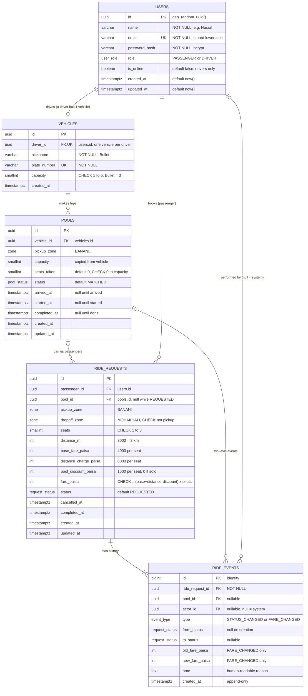

# Dhaka Tesla Pool — Database Design (ERD)

**Database:** PostgreSQL 16 · **ORM:** TypeORM (entities + migrations, `synchronize: false`)

Five tables, five enums. Every rule that protects data (capacity, seats, one active ride, fare math) is enforced **by the database itself**, not only by the code.

---

## 1. Entity Relationship Diagram



**Reading the lines**

| Line | Means |
|---|---|
| `USERS ||--o| VEHICLES` | A vehicle belongs to exactly one driver; a user has zero (passenger) or one (driver) vehicle. |
| `VEHICLES ||--o{ POOLS` | Bullet can make many trips over time. |
| `POOLS |o--o{ RIDE_REQUESTS` | A pool carries many requests; a request is in **zero pools** (still waiting) or **one**. |
| `USERS ||--o{ RIDE_REQUESTS` | Nusrat can book many rides over time. |
| `RIDE_REQUESTS ||--|{ RIDE_EVENTS` | Every request has **at least one** event (its creation). |

---

## 2. Enums

| Enum | Values |
|---|---|
| `user_role` | `PASSENGER`, `DRIVER` |
| `zone` | `BANANI`, `GULSHAN_1`, `MOHAKHALI`, `DHANMONDI`, `MIRPUR`, `UTTARA`, `FARMGATE`, `BASHUNDHARA` |
| `pool_status` | `MATCHED`, `DRIVER_ARRIVED`, `STARTED`, `COMPLETED`, `CANCELLED` |
| `request_status` | `REQUESTED`, `MATCHED`, `DRIVER_ARRIVED`, `STARTED`, `COMPLETED`, `CANCELLED` |
| `event_type` | `STATUS_CHANGED`, `FARE_CHANGED` |

A pool has no `REQUESTED` status because a pool only exists once a driver has accepted someone. Distances between zones live in a small table in code (`zones.ts`), because they never change at runtime.

---

## 3. Table by table

### `users` — everyone who logs in

| Column | Type | Rules |
|---|---|---|
| `id` | `uuid` | PK, `default gen_random_uuid()` |
| `name` | `varchar(80)` | NOT NULL |
| `email` | `varchar(255)` | NOT NULL, **UNIQUE**, lowercased before saving |
| `password_hash` | `varchar(100)` | NOT NULL, bcrypt hash, never returned by the API |
| `role` | `user_role` | NOT NULL, default `PASSENGER` |
| `is_online` | `boolean` | NOT NULL, default `false` |
| `created_at`, `updated_at` | `timestamptz` | NOT NULL, default `now()` |

**Why one table for passengers and drivers?** They log in the same way. A `role` column is simpler than two user tables with duplicated auth code.

### `vehicles` — Bullet

| Column | Type | Rules |
|---|---|---|
| `id` | `uuid` | PK |
| `driver_id` | `uuid` | FK → `users.id`, **UNIQUE** (one vehicle per driver), `ON DELETE RESTRICT` |
| `nickname` | `varchar(40)` | NOT NULL |
| `plate_number` | `varchar(20)` | NOT NULL, **UNIQUE** |
| `capacity` | `smallint` | NOT NULL, `CHECK (capacity BETWEEN 1 AND 6)` |
| `created_at` | `timestamptz` | NOT NULL |

### `pools` — one trip of one vehicle

| Column | Type | Rules |
|---|---|---|
| `id` | `uuid` | PK |
| `vehicle_id` | `uuid` | FK → `vehicles.id`, `ON DELETE RESTRICT` |
| `pickup_zone` | `zone` | NOT NULL, all passengers board here |
| `capacity` | `smallint` | NOT NULL, **copied** from the vehicle at creation |
| `seats_taken` | `smallint` | NOT NULL, default 0, `CHECK (seats_taken BETWEEN 0 AND capacity)` |
| `status` | `pool_status` | NOT NULL, default `MATCHED` |
| `arrived_at`, `started_at`, `completed_at` | `timestamptz` | NULL until that step happens |
| `created_at`, `updated_at` | `timestamptz` | NOT NULL |

**Why copy `capacity` into the pool?** So the capacity CHECK can live on one row. It also keeps old trips correct even if Bullet's capacity is ever edited.

### `ride_requests` — one passenger's booking (also the pool membership)

| Column | Type | Rules |
|---|---|---|
| `id` | `uuid` | PK |
| `passenger_id` | `uuid` | FK → `users.id`, NOT NULL, `ON DELETE RESTRICT` |
| `pool_id` | `uuid` | FK → `pools.id`, **NULL while waiting**, `ON DELETE RESTRICT` |
| `pickup_zone`, `dropoff_zone` | `zone` | NOT NULL, `CHECK (pickup_zone <> dropoff_zone)` |
| `seats` | `smallint` | NOT NULL, `CHECK (seats BETWEEN 1 AND 3)` |
| `distance_m` | `integer` | NOT NULL, `CHECK (distance_m > 0)`, copied from the zone table |
| `base_fare_paisa` | `integer` | NOT NULL, `>= 0`, per seat |
| `distance_charge_paisa` | `integer` | NOT NULL, `>= 0`, per seat |
| `pool_discount_paisa` | `integer` | NOT NULL, default 0, `>= 0`, per seat |
| `fare_paisa` | `integer` | NOT NULL, `CHECK (fare_paisa = (base_fare_paisa + distance_charge_paisa - pool_discount_paisa) * seats)` |
| `status` | `request_status` | NOT NULL, default `REQUESTED` |
| `cancelled_at`, `completed_at` | `timestamptz` | NULL until then |
| `created_at`, `updated_at` | `timestamptz` | NOT NULL |

Extra table-level rule:

```sql
CHECK (status IN ('REQUESTED','CANCELLED') OR pool_id IS NOT NULL)
-- anyone MATCHED or later must be in a pool
```

**Why no separate `pool_members` table?** A request is in at most one pool, so `ride_requests.pool_id` *is* the membership. A join table would be a second copy of the same fact to keep in sync.

**Why store the fare breakdown and not just the total?** So anyone can check the fare by hand from the row alone, and the database refuses a total that doesn't add up. The breakdown is **per seat**; `fare_paisa` is the total for the booking.

### `ride_events` — the history (append-only)

| Column | Type | Rules |
|---|---|---|
| `id` | `bigint` | PK, `GENERATED ALWAYS AS IDENTITY` (keeps insert order) |
| `ride_request_id` | `uuid` | FK → `ride_requests.id`, NOT NULL |
| `pool_id` | `uuid` | FK → `pools.id`, nullable |
| `actor_id` | `uuid` | FK → `users.id`, nullable (**NULL = the system did it**, e.g. auto-match) |
| `type` | `event_type` | NOT NULL |
| `from_status`, `to_status` | `request_status` | for `STATUS_CHANGED`; `from_status` is NULL on creation |
| `old_fare_paisa`, `new_fare_paisa` | `integer` | for `FARE_CHANGED` |
| `note` | `text` | optional, e.g. "Another passenger joined, pool discount applied". **Never names another passenger**: the owner sees their ride's timeline (`GET /rides/:id`) |
| `created_at` | `timestamptz` | NOT NULL, default `now()` |

Rows are only ever **inserted**, never updated or deleted. They are written in the **same transaction** as the change they describe.

**When the last passenger cancels, the pool is cancelled too.** Events belong to a ride request, and there is no separate pool history table, so the pool's end is recorded in the **note of that passenger's own `CANCELLED` event**: `"pool cancelled: last passenger left"`. No schema change is needed, and the note names nobody else.

---

## 4. Indexes

| Index | On | Serves |
|---|---|---|
| `uq_users_email` | `users(email)` UNIQUE | Login lookup, no duplicate accounts |
| `uq_vehicles_driver` | `vehicles(driver_id)` UNIQUE | One vehicle per driver |
| `uq_pools_active_vehicle` | `pools(vehicle_id) WHERE status IN ('MATCHED','DRIVER_ARRIVED','STARTED')` partial UNIQUE | **Bullet can't be on two active trips** |
| `ix_pools_open` | `pools(pickup_zone, status)` | Auto-join: "open pool in Banani?" |
| `uq_requests_active_passenger` | `ride_requests(passenger_id) WHERE status IN ('REQUESTED','MATCHED','DRIVER_ARRIVED','STARTED')` partial UNIQUE | **One active ride per passenger** (PRD A4) |
| `ix_requests_passenger_history` | `ride_requests(passenger_id, created_at DESC)` | "My rides" page |
| `ix_requests_waiting` | `ride_requests(status, pickup_zone, created_at)` | Driver's request list |
| `ix_requests_pool` | `ride_requests(pool_id)` | Driver's passenger list |
| `ix_events_request` | `ride_events(ride_request_id, id)` | A ride's timeline in order |

Partial unique indexes turn two PRD rules into database guarantees: even if two browser tabs submit at once, Nusrat can't hold two active rides.

---

## 5. The story as rows

What the database holds at **8:47 AM**, after Rafiq and Shirin joined and Jashim started the trip (PRD §14 demo, IDs shortened).

**`vehicles`**

| id | driver_id | nickname | capacity |
|---|---|---|---|
| `v-bullet` | `u-jashim` | Bullet | 3 |

**`pools`**

| id | vehicle_id | pickup_zone | capacity | seats_taken | status |
|---|---|---|---|---|---|
| `p-1` | `v-bullet` | BANANI | 3 | **3** | STARTED |

**`ride_requests`**

| passenger | pool_id | from → to | seats | base | distance | discount | **fare_paisa** | status |
|---|---|---|---|---|---|---|---|---|
| Nusrat | `p-1` | BANANI → MOHAKHALI | 1 | 4000 | 6000 | 1500 | **8500** (85 ৳) | STARTED |
| Rafiq | `p-1` | BANANI → GULSHAN_1 | 1 | 4000 | 8000 | 2000 | **10000** (100 ৳) | STARTED |
| Shirin | — | BANANI → GULSHAN_1 | 2 | 4000 | 8000 | 0 | **24000** (240 ৳) | CANCELLED |
| Shirin | `p-1` | BANANI → GULSHAN_1 | 1 | 4000 | 8000 | 2000 | **10000** (100 ৳) | STARTED |

Check: Nusrat `(4000 + 6000 − 1500) × 1 = 8500` ✓ · Rafiq and Shirin `(4000 + 8000 − 2000) × 1 = 10000` ✓ · Shirin's first request `(4000 + 8000 − 0) × 2 = 24000` (never matched, so solo fare) ✓ · seats of the active requests `1 + 1 + 1 = 3 = seats_taken` ✓

**`ride_events` for Nusrat**

| id | type | from → to | fare | actor | note |
|---|---|---|---|---|---|
| 1 | STATUS_CHANGED | — → REQUESTED | | Nusrat | |
| 2 | STATUS_CHANGED | REQUESTED → MATCHED | | Jashim | Accepted by the driver, new pool created |
| 5 | FARE_CHANGED | | 10000 → 8500 | *system* | Another passenger joined, pool discount applied |
| 12 | STATUS_CHANGED | MATCHED → DRIVER_ARRIVED | | Jashim | |
| 15 | STATUS_CHANGED | DRIVER_ARRIVED → STARTED | | Jashim | Fare locked |

(The gaps in the IDs are Rafiq's and Shirin's events — their requests, auto-matches, fare changes, Shirin's cancel and their trip steps — stored in the same table. Shirin joining doesn't change Nusrat's fare: the pool already had 2+ bookings, and the discount counts bookings, not seats — PRD §7.)

---

## 6. What protects what

| Risk | Stopped by |
|---|---|
| 4 people in 3-seat Bullet | `CHECK (seats_taken BETWEEN 0 AND capacity)` + atomic `UPDATE … WHERE seats_taken + :seats <= capacity` |
| Bullet on two trips at once | Partial unique `uq_pools_active_vehicle` |
| Nusrat books twice | Partial unique `uq_requests_active_passenger` |
| Matched passenger with no pool | `CHECK (status IN ('REQUESTED','CANCELLED') OR pool_id IS NOT NULL)` |
| Fare total that doesn't add up | `CHECK (fare_paisa = (base + distance − discount) × seats)` |
| Same pickup and drop-off, 0 seats | `CHECK` constraints on `ride_requests` |
| Deleting a user erases ride history | All FKs `ON DELETE RESTRICT` |
| Rounding errors in money | Integer paisa everywhere |

**One rule the database doesn't check alone:** that `pools.seats_taken` equals the sum of its passengers' seats. Both are always changed together inside **one transaction** in `claimSeat()` and `releaseSeats()`, and test T1/T6 verify it.

---

## 7. TypeORM mapping (example)

```ts
@Entity('pools')
@Check('ck_pools_seats', '"seats_taken" BETWEEN 0 AND "capacity"')
@Index('uq_pools_active_vehicle', ['vehicleId'], {
  unique: true,
  where: `"status" IN ('MATCHED','DRIVER_ARRIVED','STARTED')`,
})
export class Pool {
  @PrimaryGeneratedColumn('uuid') id: string;

  @ManyToOne(() => Vehicle, { onDelete: 'RESTRICT', nullable: false })
  @JoinColumn({ name: 'vehicle_id' })
  vehicle: Vehicle;

  @Column({ name: 'vehicle_id', type: 'uuid' }) vehicleId: string;
  @Column({ name: 'pickup_zone', type: 'enum', enum: Zone, enumName: 'zone' }) pickupZone: Zone;
  @Column({ type: 'smallint' }) capacity: number;
  @Column({ name: 'seats_taken', type: 'smallint', default: 0 }) seatsTaken: number;
  @Column({ type: 'enum', enum: PoolStatus, enumName: 'pool_status', default: PoolStatus.MATCHED })
  status: PoolStatus;

  @OneToMany(() => RideRequest, (r) => r.pool) requests: RideRequest[];
  // arrived_at, started_at, completed_at, created_at, updated_at …
}
```

The other four entities follow the same pattern. Run `migration:generate`, **read the generated SQL**, and check that every CHECK and partial index from this document is in it before committing.