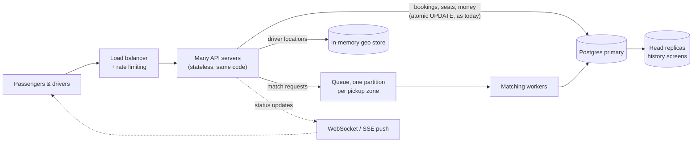

# If Oi Tesla goes viral: 1M passengers, 100k drivers

Not built. This is how the MVP would grow, and why. The MVP code stays unchanged.

## Back-of-envelope numbers

| Load | Estimate | What it means |
|---|---|---|
| Ride requests | 1M passengers × ~1 ride/day over ~10 busy hours → ~100k/h ≈ **~30/s** (a few times that at the rush-hour peak) | Postgres handles this on one primary |
| Status polling | 100k active riders polling every 5 s → **~20k reads/s** | The first thing that hurts the API and the DB |
| Driver locations (if we add GPS) | 100k drivers every 4 s → **~25k writes/s** | Too many small writes for the bookings DB |

## What breaks first, and what we'd add

1. **Polling (reads).** 20k/s of "anything new?" reads. → Push updates over **WebSockets/SSE**, and serve history screens from **read replicas**. Bookings stay on the primary.
2. **Driver locations (writes).** Losing a 4-second-old location is fine, and losing a booking is not. → Keep locations in a **fast in-memory geo store** (e.g. Redis GEO), never in Postgres.
3. **Matching.** Today it is one `UPDATE … WHERE seats_taken + :seats <= capacity`. That still works at scale, because at most 3 people ever compete for one pool. City-wide matching (which pool, which driver) becomes the work. → Put requests on a **queue partitioned by pickup zone**, so each zone is matched in order by its own worker.
4. **The API servers.** They are already stateless (JWT, no sessions). → Run **many copies behind a load balancer** with **rate limiting**.
5. **Double taps on a bad network.** → **Idempotency keys** on `POST /rides` and accept, so a retry never books twice.
6. **Seeing problems early.** → **Metrics and alerts** on matching time, 409 rates, DB lock waits and queue lag.

**What we would keep:** Postgres as the source of truth for seats and money, the atomic seat `UPDATE` with its `CHECK` safety net, the conditional status updates, and the append-only `ride_events` history. Those are what make the system correct. Everything added above only makes it faster.
